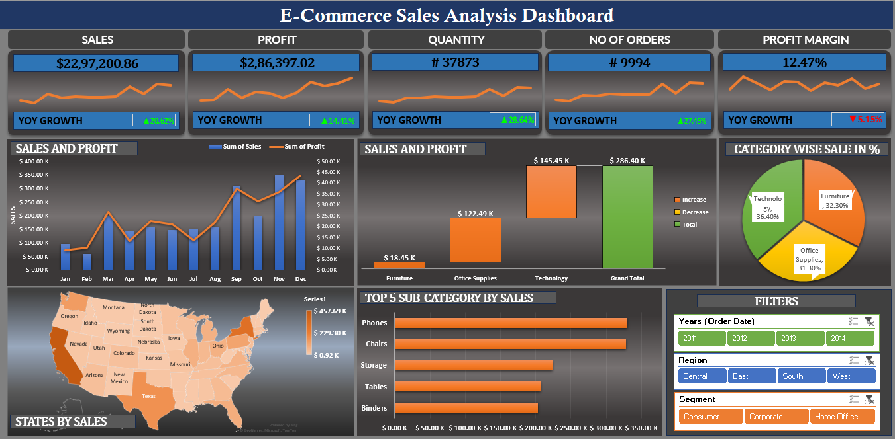

## 📊 E-commerce Sales Analysis
### 🧩 Introduction
This repository contains a comprehensive analysis of e-commerce sales data. The primary objective of this project is to explore a dataset from a retail company, identify key trends, and extract actionable insights to drive strategic business decisions. By examining various aspects of the sales data, from high-level performance indicators to granular details on product categories and geographical distribution, this analysis aims to provide a clear picture of the company's performance and highlight potential areas for growth and improvement.

### 🔍 The project delves into several key areas of analysis, including:

- **Sales and Profitability**: A detailed look at overall revenue and profit margins.

- **Product Performance**: Analysis of sales and profit by product category and sub-category to identify top-performing items.

- **Geographical Insights**: Mapping sales data to understand regional performance and customer distribution.

- **Key Performance Indicators (KPIs)**: Tracking essential metrics to gauge business health and success.

- **Temporal Trends**: Examining year-over-year (YoY) growth to understand performance over time.

## 📈 Dash-Board Snap

## 🧠 Key Insights from the Analysis
This analysis of the e-commerce dataset reveals several key trends and performance metrics across product categories, geographic regions, and time. The following are the primary insights drawn from the data:

### **1. Overall Performance & Profitability**
- **Strong Sales, but Profitability is a Concern**: The company generated significant revenue, totaling approximately $2.3 million in sales. However, the overall profit margin is relatively low at 12.4%, with a total profit of around $286,000.

- **Positive Year-over-Year Growth**: The business is expanding, showing a healthy 17% year-over-year (YoY) growth in sales, indicating successful market penetration or increased customer demand.

### **2. Product Category Performance**
- **Technology is the Star Performer**: The Technology category is the primary driver of both sales and profit. It accounts for the highest portion of revenue and delivers the strongest profit margins.

- **Top Sub-Categories**: Within Technology, Copiers and Phones are exceptionally profitable.

- **Furniture Category is Unprofitable**: Despite being a significant source of sales, the Furniture category is a major area of concern. It consistently generates losses, dragging down overall profitability.

- **Problematic Sub-Categories**: Tables and Bookcases are the biggest loss-making sub-categories in the entire product catalog.

- **Office Supplies are Stable**: The Office Supplies category generates consistent sales and maintains a healthy profit margin, making it a reliable, though not explosive, part of the business.

### **3. Geographical Sales Distribution**
- **Top Markets Identified**: The majority of sales are concentrated in a few key states. California and New York are the top two markets, contributing the most to overall revenue.

- **Underperforming Regions**: Several states, including Texas, show high sales volumes but experience significant losses, mirroring the issues seen in the Furniture category. This suggests that problematic products are disproportionately affecting certain regional markets.

## **Actionable Recommendations**
- **Re-evaluate the Furniture Category**: A thorough review of the Tables and Bookcases sub-categories is critical. Strategies could include discontinuing unprofitable items, adjusting pricing, or creating product bundles to increase profitability.

- **Double Down on Technology**: Focus marketing and inventory efforts on the high-margin Technology category, particularly on top performers like Copiers and Phones.

- **Targeted Regional Strategy**: Develop a market-specific strategy for states like Texas. Analyze the product mix being sold there to understand why it's unprofitable and adjust sales strategies accordingly.
